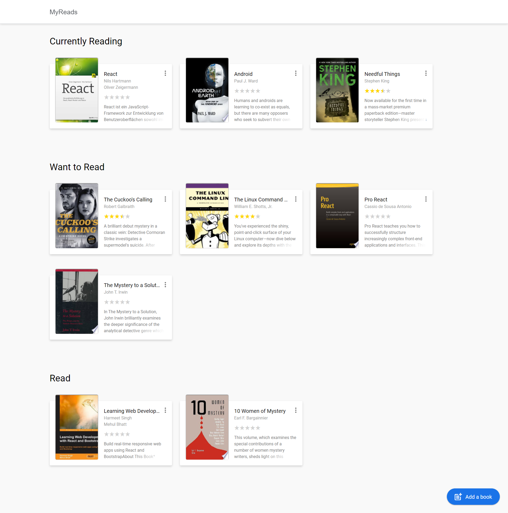
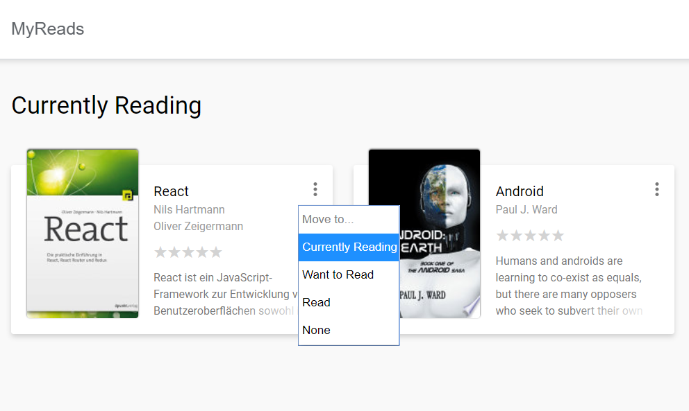

# MyReads Project

## Project purpose:
This project was built for the UdacityNanodegree Program. The purpose of the project is to demonstrate understanding of the fundamentals of the React ecosystem.

## Loading the App

You can run a hosted version of the app at: 

The project uses Node.js and the Create-React-App starter.
Once Node is installed, navigate to the directory where you want to store the app.

```bash
git clone https://github.com/m-reyes-h/react-project-myreads.git
npm install
npm start
```
A new browser window should automatically open. If it doesn't, navigate to http://localhost:3000/ in your browser.



## Using the App

MyReads project, is a bookshelf app that allows you to select and categorize books you have read, are currently reading, or want to read.

* Books are sorted into three categories: Currently Reading, Want to Read and Read

* To change a book's category, click on the three dots menu on the book cover

```bash
You can remove a book from the shelf by selecting "None"
```

* To add new books, click on the blue button  at the bottom of the page.

#### Search page


_You can only search by author or title. So, don't worry if you don't find a specific author or title._


NOTES: The search from BooksAPI is limited to a particular set of search terms listed below: [search terms](#search-terms)


#### Search Terms

Android, Art, Artificial Intelligence, Astronomy, Austen, Baseball, Basketball, Bhagat, Biography, Brief, Business, Camus, Cervantes, Christie, Classics, Comics, Cook, Cricket, Cycling, Desai, Design, Development, Digital Marketing, Drama, Drawing, Dumas, Education, Everything, Fantasy, Film, Finance, First, Fitness, Football, Future, Games, Gandhi, History, History, Homer, Horror, Hugo, Ibsen, Journey, Kafka, King, Lahiri, Larsson, Learn, Literary Fiction, Make, Manage, Marquez, Money, Mystery, Negotiate, Painting, Philosophy, Photography, Poetry, Production, Program Javascript, Programming, React, Redux, River, Robotics, Rowling, Satire, Science Fiction, Shakespeare, Singh, Swimming, Tale, Thrun, Time, Tolstoy, Travel, Ultimate, Virtual Reality, Web Development, iOS


### Resources and Documentation:

- [Create-react-app Documentation](https://github.com/facebookincubator/create-react-app)
- [React Router Documentation](http://knowbody.github.io/react-router-docs/)
- [React API](https://facebook.github.io/react/docs/react-api.html)
- [Debouncing and Throttling Explained](https://css-tricks.com/debouncing-throttling-explained-examples/)

### Udacity Resources:

- [Project starter template](https://github.com/udacity/reactnd-project-myreads-starter)
- [Project Rubric](https://review.udacity.com/#!/rubrics/918/view)
- [Udacity CSS Style Guide](http://udacity.github.io/frontend-nanodegree-styleguide/css.html)
- [Udacity HTML Style Guide](http://udacity.github.io/frontend-nanodegree-styleguide/index.html)
- [Udacity JavaScript Style Guide](http://udacity.github.io/frontend-nanodegree-styleguide/javascript.html)